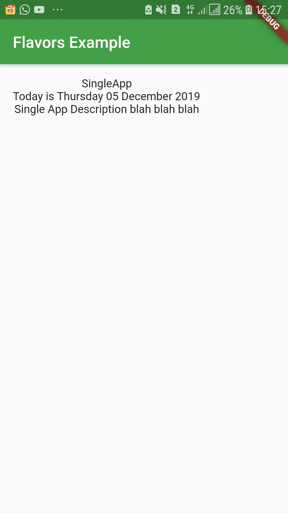

kita akan membuat projek dengan 2 tampilan aplikasi. Setiap aplikasi akan menampilkan nama aplikasi (spesifik per tampilan), 
tanggal saat ini, deskripsi singkat, dan dua gambar (satu spesifik per tampilan).

kita membuat folder app1 dan app2 di dalam android / app / src. Di setiap folder itu, 
kita membuat folder res lalu folder values. 
Di dalam setiap folder values, kami membuat strings.xml 

